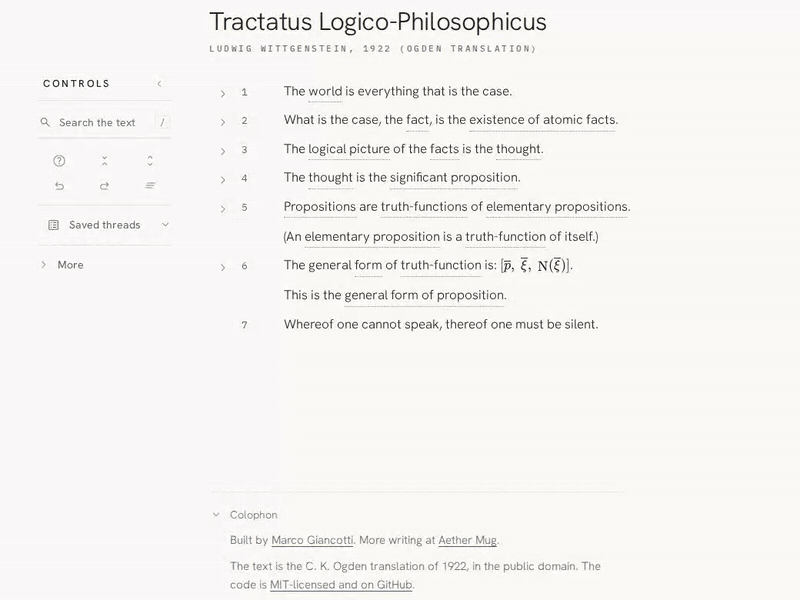
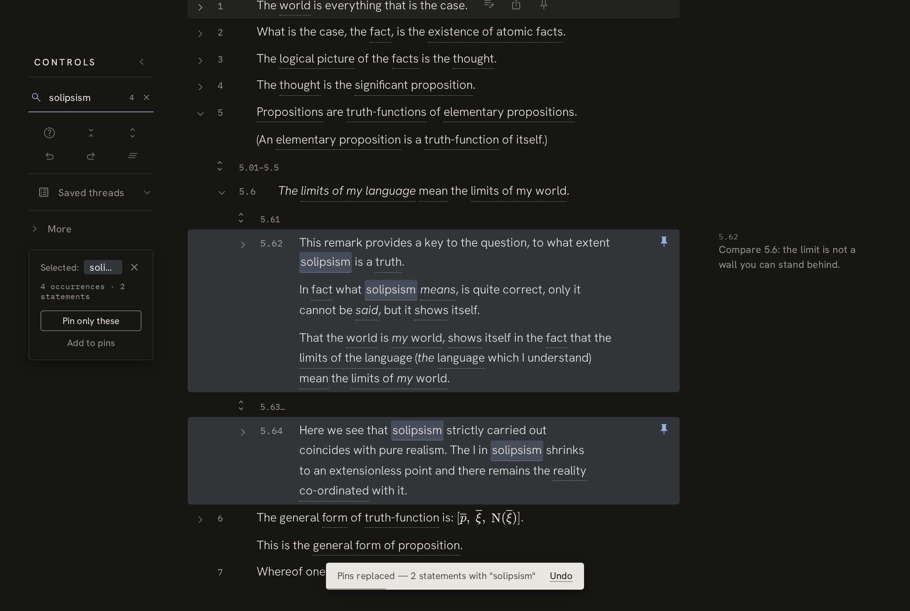

# The Foldable Tractatus

[](https://github.com/marcogiancotti/foldable-tractatus/actions/workflows/ci.yml)
[](LICENSE)

An interactive reader for Wittgenstein's *Tractatus Logico-Philosophicus*, in
C. K. Ogden's 1922 English translation.

**Read it at [foldabletractatus.aethermug.com](https://foldabletractatus.aethermug.com)**



## Why

Wittgenstein numbered his remarks instead of paginating them, and the numbering
is a tree: 2.01 elaborates 2, 2.011 elaborates 2.01, and the nesting reaches six
levels in places. Printed editions flatten that tree into one long column,
so following a single line of argument means reading past everything that
happens to be interleaved with it.

This reader keeps the tree as a tree. You fold away the branches you are not
reading, pin the ones you are, and the rest stays on screen in a quieter form
rather than vanishing, so you never lose your sense of where you are in the
book.

## What you can do with it

- **Fold and unfold.** The book opens as its seven root propositions, and each
  one discloses a level at a time. There are fold-all and unfold-all controls
  when you want to reset.
- **Pin what you are reading.** Pinned statements and their ancestors are shown
  in full, while their siblings collapse into merged "peek" ranges (`5.01–5.5`)
  that you can open with a click. Pinning is how you build a cross-section of
  the book that follows one theme.
- **Trace a term.** The technical vocabulary is indexed and clickable in the
  text, free search behaves the same way, statements folded out of sight carry a
  count badge, and you can turn any set of matches straight into pins.
- **Annotate the margin.** Notes are plain text, saved as you type, kept in your
  browser, and never written into a share link.
- **Follow cross-references.** The few places where Wittgenstein cites another
  statement by number open a preview card in place, with a jump if you decide to
  go there.
- **Undo anything.** The whole history is in the app rather than in the
  browser's Back button, which continues to do what browsers do.
- **Share the view.** Pins, folds, the selected term and the reading path all
  live in the query string, so a link reproduces exactly what you were looking
  at. `?statement=N` links a single statement.
- **Take it with you.** There is a Markdown study export and a print-formatted
  PDF route, both carrying your pinned statements with their lineage and all
  your notes.
- **Sync privately, if you want to.** The optional sync feature encrypts your
  notes in the browser and stores them under a link whose key never reaches the
  server.

The reader is keyboard-driven throughout, works in light and dark themes, and
needs no account, no server and no network once the page has loaded.



## Keyboard

| Keys | Action |
| --- | --- |
| <kbd>Tab</kbd> | Enter or leave the statement tree |
| <kbd>↑</kbd> <kbd>↓</kbd> or <kbd>k</kbd> <kbd>j</kbd> | Previous / next statement |
| <kbd>→</kbd> <kbd>←</kbd> | Unfold one level / fold |
| <kbd>⇧</kbd><kbd>→</kbd> | Unfold everything beneath |
| <kbd>P</kbd> | Pin or unpin |
| <kbd>Enter</kbd> | Add or edit an annotation |
| <kbd>S</kbd> | Copy a link to this statement |
| <kbd>/</kbd> | Search the text |
| <kbd>?</kbd> | Show the full list in the app |

Single-key shortcuts can be switched off in the reader guide, per WCAG 2.1.4.

## How it works

Almost nothing about the visible layout is stored anywhere. The entire view is a
set of pinned ids plus a sparse map of manual fold overrides, and every row's display state (full, collapsed, peek or hidden) is
*derived* from that pair against the fixed tree, on every render. Peek ranges in
particular are computed and never written down.

That is what makes the share link short and the undo history cheap: both are
just snapshots of the same small pair of values. The derivation lives in
[`src/model/focusedView.ts`](src/model/focusedView.ts) and is the first thing to
read if you want to understand the codebase; its behaviour is specified in
[`docs/foldable-tractatus-spec.md`](docs/foldable-tractatus-spec.md), which the
code refers to by section number.

## Running it locally

```sh
npm install
npm run dev      # Vite dev server on localhost:5173
npm test         # vitest: derivation, term matching, URL codec, crypto, backend
npm run build    # typecheck (tsc --noEmit) followed by a production build
```

Node is pinned in `.nvmrc`. There is no separate lint step, since
type-checking with `tsc --noEmit` runs as part of the build.

Everything works with no configuration at all. The two optional features are
enabled by environment variables at build time: `VITE_SYNC_ENDPOINT` for
encrypted note sync against a backend you deploy yourself, and
`VITE_PLAUSIBLE_DOMAIN` with `VITE_PLAUSIBLE_SRC` for self-hosted analytics.
Copy `.env.example` to `.env` to set them. Left unset, neither feature exists in
the build.

## Repository layout

| Path | What lives there |
| --- | --- |
| `src/model/` | Pure logic: the focused-view derivation, the tree index, the prefix matcher, the URL codec, history |
| `src/state/` | Reducer store with undo, redo and toasts, plus localStorage persistence |
| `src/components/` | Reading column, statement rows, peek ranges, control panel, notes, overlays |
| `src/data/` | The 526-statement Ogden text with its cross-references, the curated term index, and the reading paths |
| `backend/` | The Val Town val behind encrypted sync, with tests that run against in-memory libsql |
| `vite/` | Build-only plugins, including the prerender that makes the text crawlable |
| `docs/` | The functional spec and the analytics catalogue |

Deployment, to any static host and optionally a Val Town val, is documented in
[`DEPLOY.md`](DEPLOY.md).

## Privacy

The reader runs entirely in your browser. Notes are kept in `localStorage` and
are never placed in a share link. If you use the optional sync, the bundle is
encrypted with AES-GCM-256 before it is uploaded and the key stays in the URL
fragment, which browsers do not send to servers, so the host is left holding
ciphertext it has no way to read.

A deployment may enable self-hosted, cookieless
[Plausible](https://plausible.io) analytics. There is no visitor identifier and
no cross-site tracking, and nothing you write is ever collected: annotations are
not read at all, and a free-text search is counted as `(free search)` rather
than as whatever you typed. What it counts is aggregate, such as whether anyone
pinned anything or opened the guide, and the complete list is in
[`docs/analytics.md`](docs/analytics.md). Do Not Track and Global Privacy
Control are both honoured, so the script never loads for readers who send
either. This repository ships with analytics off; turning it on takes explicit
configuration.

## Contributing

Issues and pull requests are welcome. Please read
[`CONTRIBUTING.md`](CONTRIBUTING.md) first: besides the branching and PR rules,
it lists the handful of invariants that are easy to break by accident, such as
the statement data being generated, the focused view being derived rather than
stored, and share links being a published format that has to stay
backward-compatible.

## License

Code is [MIT](LICENSE), © [Marco Giancotti](https://aethermug.com).

Ogden's 1922 translation of the *Tractatus* is in the public domain. The curated
term index, the reading paths and the specification under `docs/` are original
work released under the same MIT license.
